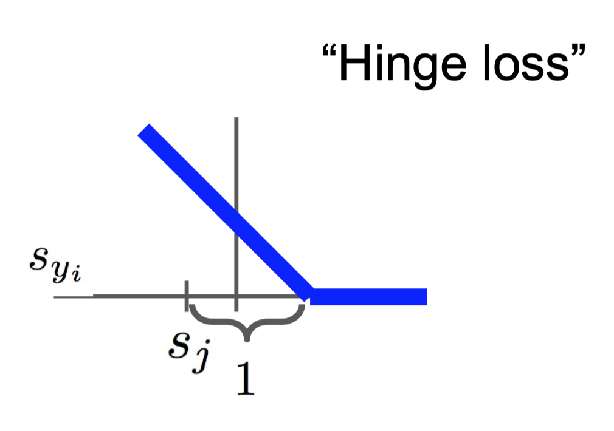
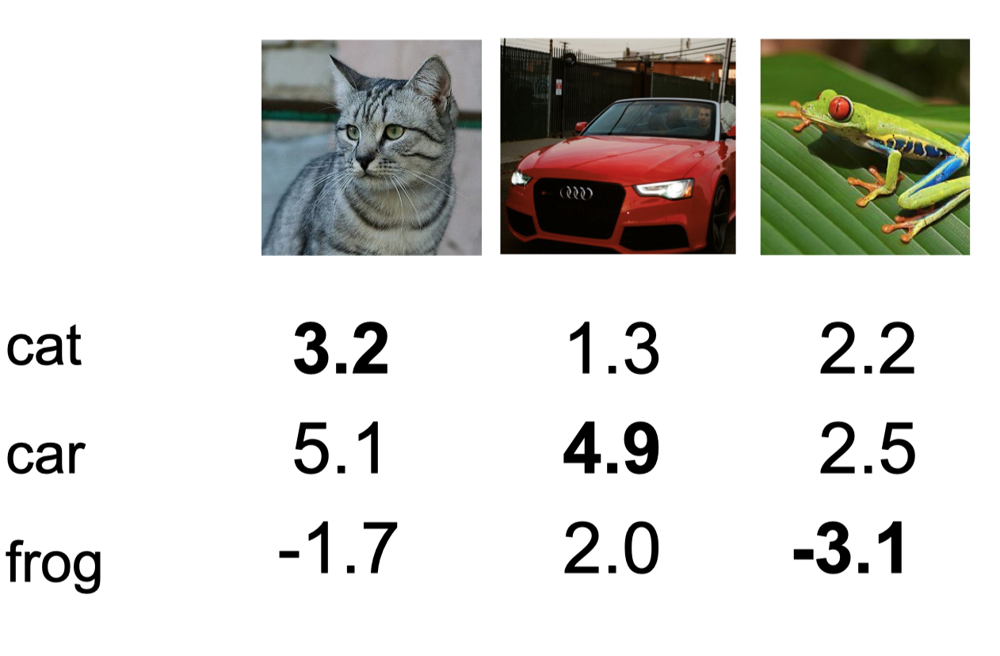

[Lecture 3-Loss Functions and Optimization](https://www.youtube.com/watch?v=h7iBpEHGVNc&list=PL3FW7Lu3i5JvHM8ljYj-zLfQRF3EO8sYv&index=3)와 강의자료를 참고하여 개인적으로 정리한 글입니다.

$n$ x $n$ x 3차원의 Image input $x$와 $W$(parameters 혹은 weights)에 대하여 $f(x,W)=Wx+b$를 연산하면 각 labels에 대한 scores를 구할 수 있다. 정답인 label의 score가 가장 높다면, 우리의 분류기는 입력 이미지를 잘 분류한 것이다. 당연하게도 이미지 분류의 최종적인 목표는 임의의 이미지를 최대한 잘 분류하는 것인데, 이는 $W$를 찾는 것으로 귀결된다. 그렇다면 $W$를 어떻게 찾아야 할까?

# Loss Functions

> TODO 1 : Define a **loss function** that quantifies our unhappiness with the scores across the training data.

Training data를 학습할 때 그 단계에서 얼마나 틀리게 분류했는지 수치화할 필요가 있는데 그것이 loss function(손실 함수)이다. Loss function의 정의는 다음과 같다.

$$ L = \frac{1}{N} \sum_i{L_i(f(x_i,W),y_i)} \text{ where } x_i \text{ is image and } y_i \text{ is label.} $$

우리의 분류기가 계산한 $f(x_i,W)$와 정답인 $y_i$와의 차이를 계산 하고 이를 모두 더해 평균을 낸 것이다. 여기서는

1. Multiclass SVM loss
2. Cross Entropy
3. MSE(Mean of Squared Error)

를 소개하려고 한다.

## Multiclass SVM loss

Multiclass SVM loss는 $s_i = f(x_i,W)$에 대하여 $L_i = \sum_{j \neq y_i} max(0, s_j-s_{y_i}+1)$이다. 수식으로는 바로 이해하기 힘드니 예시를 살펴보자.

CIFAR-10 training data의 일부인데, 10개의 클래스는 너무 많으니 3개만 살펴보자. 첫번째 사진의 정답 label은 고양이이다. 따라서 고양이 클래스를 제외한 나머지 클래스의 $s_j$와 $s_{cat}$로 계산한다. 즉, 첫번째 이미지의 loss는 $max(0, 5.1-3.2+1) + max(0, -1.7-3.2+1)=2.9$이다. 이런식으로 나머지 이미지들의 loss를 계산해보면, 각각 0과 12.9가 되겠다.

Multiclass SVM loss의 특징을 살펴보자.

1. 식을 유심히 살펴보면 알 수 있겠지만, 이 loss function은 *정답인 label의 $s$값이 가장 크면 0의 값을, 그렇지 않으면 양수의 값을* 반환해준다. 세번째 이미지처럼 정답인 label의 $s$값이 너무 작으면 loss가 점점 커지는 것을 확인할 수 있다. 또한, 정답 label의 값이 가장 크기만 하면, 다른 값들이 어떻든 상관없이 0의 값을 반환한다.(위의 hinge loss 그림 참고)
2. 최솟값은 0, 최댓값 $\infty$이다.
3. 모든 $s$값이 0에 가까운 값을 가지면 (클래스의 수)-1의 값을 가진다. 이는 초기 학습 단계에서 debug procedure에서 유용하게 이용할 수 있다. 초기에는 $W$가 작으므로 (클래수의 수)-1의 값을 가질 확률이 높기 때문이다.
4. 정답 label을 계산에 포함시켜도 단순히 1씩 증가할 뿐, 이는 scaling만 달라지기 때문에 의미가 없다.
5. 합계 대신 평균을 사용해도 4번과 마찬가지로 의미가 없다.
6. $max^2$을 사용하면 아슬아슬하게 정답을 맞춘 경우 loss가 기존보다 더 작아질 것이고 더 많이 틀리게 분류할 수록 loss가 점점 커질 것이다.

## Cross Entropy

## MSE
